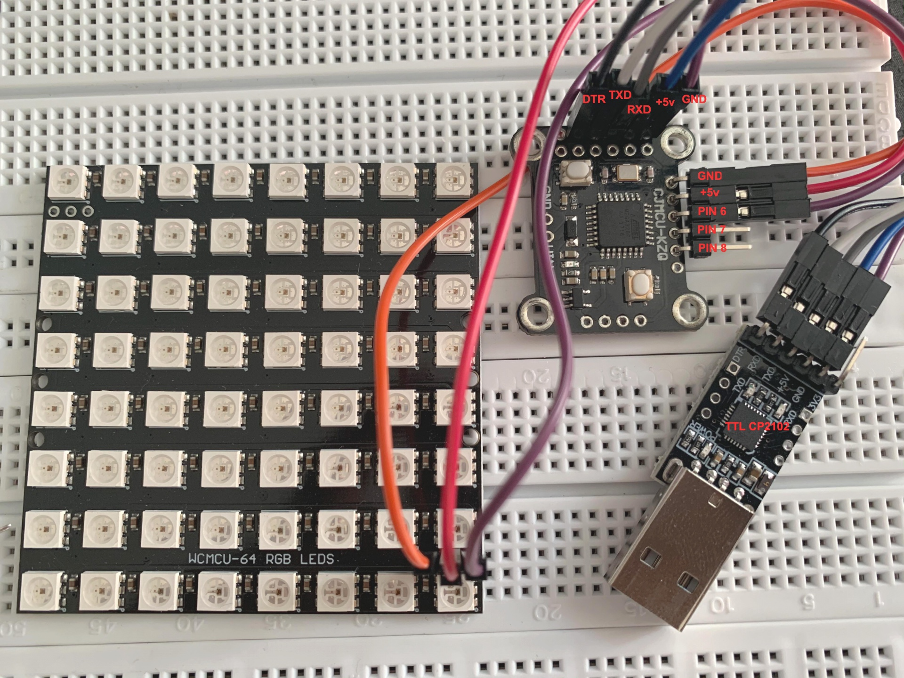

# cjmcu-kzq-sample
This is sample of using CJMCU-KZQ board to control NeoPixel LEDs. I found joy with this cheap board, hope this sample helps you a little bit 
All that we need is the USB to TTL UART CP2102, Arduino IDE, and NeoPixel codes ^_^  
#### USB CP2102 adapter
Find download and install the driver for the CP2102 at https://www.silabs.com/developers/usb-to-uart-bridge-vcp-drivers

#### Arduino Settings

On the Arduino IDE set following:
<ol>
<li> Board: <b>Arduino Pro or Pro Mini</b> </li>
<li> Processor: <b>ATmega328P (5V, 16MHz)</b> </li>
<li> Port: <b>/dev/cu.SLAB_USBtoUART</b> (on MacOS, maybe different on your OS) </li>
<li> Programmer: <b>USBasp</b> </li>
</ol>

#### Connection
For connections between CP2101, CJMCU-KZQ and the NeoPixel LEDs, you can refer to mine below:

You can refer to https://github.com/dieter-l-git/CJMCU-KZQ-Documentation/blob/master/schematic.pdf for more information 
Many thanks to [@dieter-l-git](https://github.com/dieter-l-git/CJMCU-KZQ-Documentation) who did a great work on the schematic of CJMCU-KZQ

#### Demo
https://www.youtube.com/watch?v=ZqvJpk6eiAc

Thank you!